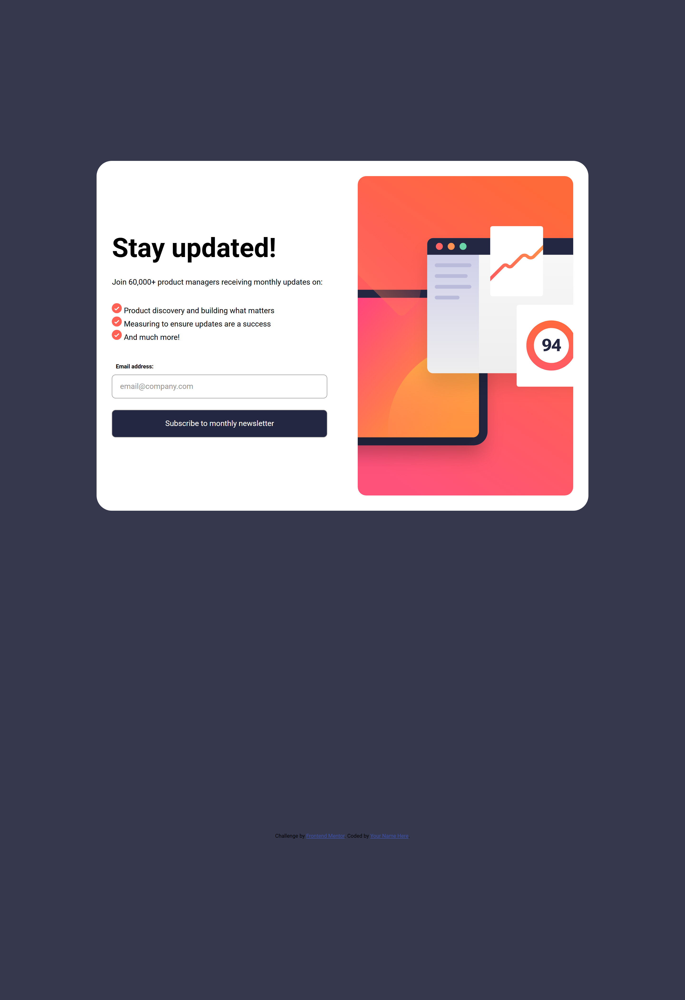
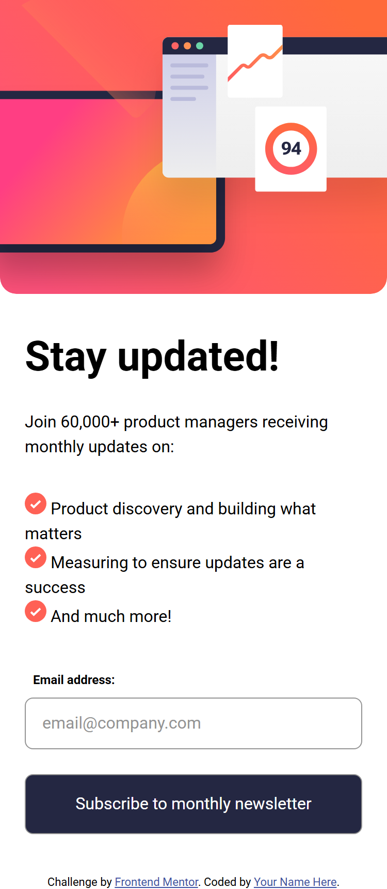
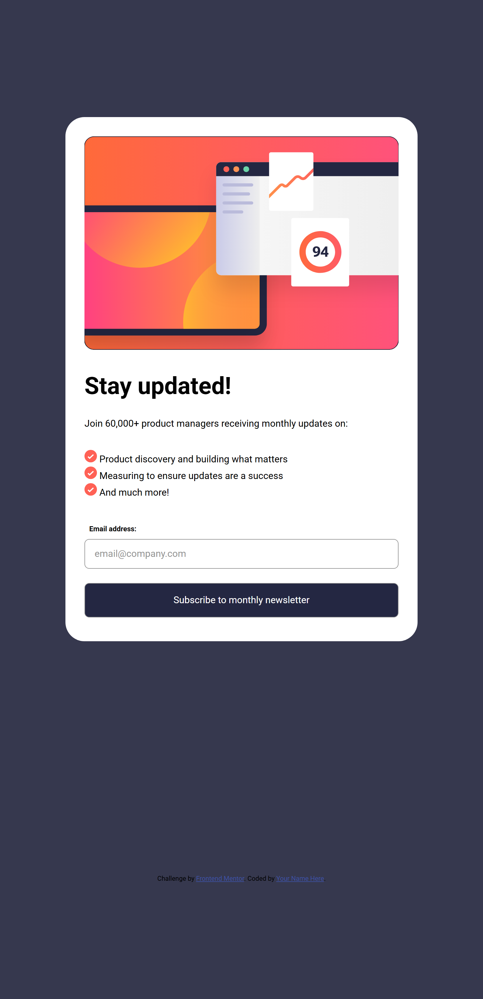

# Frontend Mentor - Newsletter sign-up form with success message


## Welcome! 👋

This is a solution to the [Newsletter sign-up form with success message challenge on Frontend Mentor](https://www.frontendmentor.io/challenges/newsletter-signup-form-with-success-message-uPurx1GUv). Frontend Mentor challenges help you improve your coding skills by building realistic projects.

## Table of contents

- [Overview](#overview)
  - [The challenge](#the-challenge)
  - [Screenshots](#screenshots)
  - [Links](#links)
- [My process](#my-process)
  - [Built with](#built-with)
  - [What I learned](#what-i-learned)
- [Author](#author)

## Overview

### The challenge

Users should be able to:

- Add their email and submit the form
- See a success message with their email after successfully submitting the form
- See form validation messages if:
  - The field is empty
  - The email address is not formatted correctly
- View the optimal layout for the interface depending on their device's screen size
- See hover and focus states for all interactive elements on the page

## 📸 Screenshots

| Desktop                        | Mobile               | Success State (Mobile) |
| ------------------------------ | -------------------- | ---------------------- |
|  |  |  |

_(Replace these paths with your actual project screenshots)_

---

### Links

- Solution URL: [Frontend Mentor Solution](https://www.frontendmentor.io/solutions/newsletter-signup-form-vanilla-js-validation-YOUR-LINK-HERE)
- Live Site URL: [GitHub Pages](https://emelinur.github.io/newsletter-sign-up-form/)

## My process

### Built with

- Semantic HTML5 markup
- CSS Custom Properties
- Flexbox
- Mobile-first workflow
- Vanilla JavaScript (DOM Manipulation & Regex Validation)

### What I learned

This project was a significant milestone in my JavaScript journey. I moved beyond simple DOM manipulation and learned to think algorithmically about form handling and state management.

Here are my key takeaways:

1. **Form Events: Submit vs. Click**
   I learned that listening to the `submit` event on the `<form>` is much better than listening to the `click` event on the button. This ensures the form handles both mouse clicks and keyboard (Enter key) submissions correctly, while `e.preventDefault()` stops the page from reloading.

   ```javascript
   // Instead of button.addEventListener('click')...
   newsletterForm.addEventListener("submit", (e) => {
     e.preventDefault(); // Prevents default browser reload
     // Validation logic here...
   });